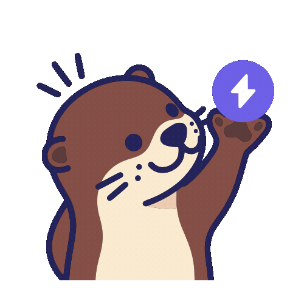
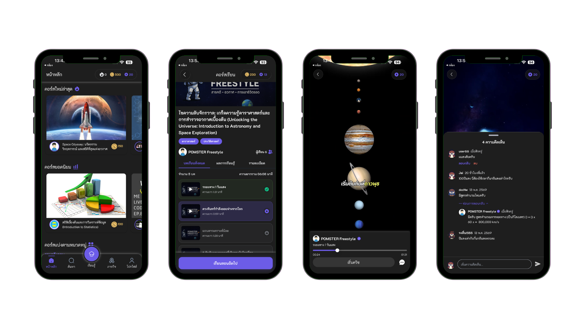
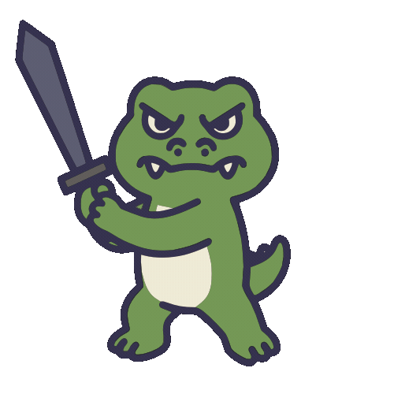
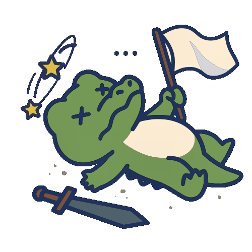
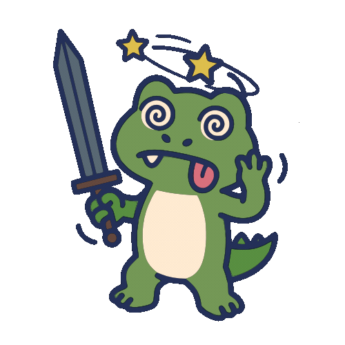
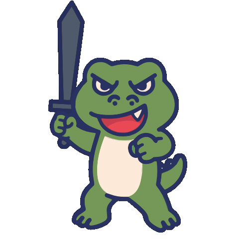
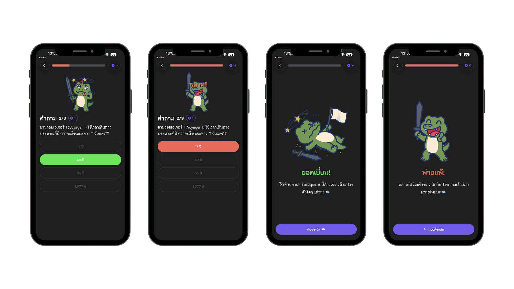
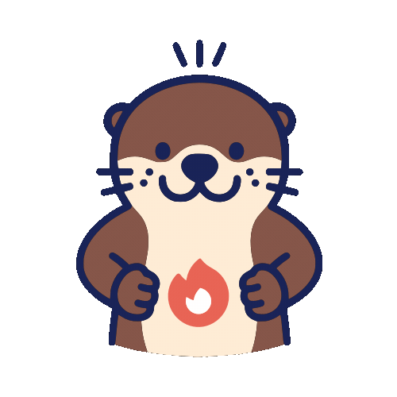
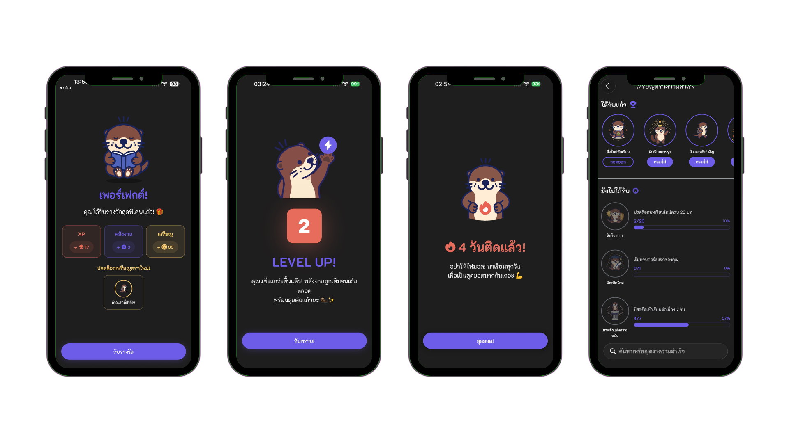
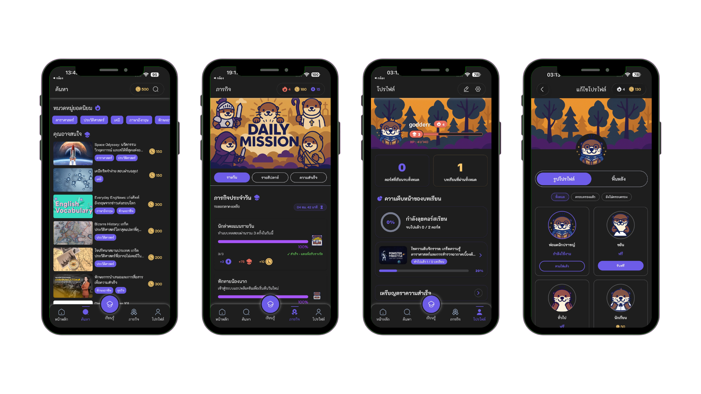

# 🦦 LearnvelUp - Gamified Mobile Microlearning Platform


<div align="center">
  
</div>

> **LearnvelUp** is a senior capstone project designed to revolutionize mobile learning by combining **Bite-sized Microlearning** with a powerful **Gamification Engine**. Learning is no longer boring when you can earn XP, maintain streaks, defeat bosses, and customize your otter avatar! 🦦✨

---

## 📖 About The Project

Traditional online learning often struggles with user retention. **LearnvelUp** solves this by breaking down complex subjects into digestible, bite-sized lessons (**Microlearning**) and rewarding users for their consistency (**Gamification**). 

Whether you're exploring astronomy or battling a crocodile boss in a quiz, every action in the app rewards you with XP, Energy, or Coins, driving intrinsic motivation to keep learning.

---

## 🚀 Core Features

### 🎮 Gamification & Virtual Economy
- **XP & Leveling System:** Earn XP by completing lessons and passing quizzes to level up your profile.
- **Energy Mechanics:** An engaging energy system (regenerates over time) required to take quizzes, preventing burnout.
- **Daily Streaks:** Maintain learning consistency to keep your streak "on fire".
- **Achievement Badges:** Unlock and equip exclusive badges for hitting learning milestones.
- **Item Shop & Customization:** Earn coins to purchase dynamic profile backgrounds and otter avatars.

### 📚 Interactive Microlearning
- **Structured Learning Paths:** Guided courses with prerequisite locking systems to ensure step-by-step understanding.
- **Interactive Quizzes:** "Boss Battle" style quizzes featuring custom Lottie animations (e.g., defeating a boss upon passing).
- **Progress Tracking:** Visual progress bars and circular charts to track course completion rates.

---

## 🛠 Tech Stack & Architecture

This project was built with a strong emphasis on clean architecture, performance, and modern mobile development practices.

* **Frontend Framework:** `React Native` with `Expo Router` for file-based navigation.
* **Styling:** `NativeWind v4` (TailwindCSS) for rapid, utility-first UI development and responsive design.
* **State Management (Decoupled):**
    * `Zustand`: Used for global client-side state (User Auth Sessions, UI toggles).
    * `TanStack Query (React Query)`: Used for asynchronous server-state management, caching, and automatic UI synchronization (e.g., updating the coin balance instantly after purchasing an item).
* **Backend & Database:** `Supabase` (BaaS) for PostgreSQL database, secure Authentication, and Row Level Security (RLS).
* **Animations:** `Lottie-React-Native` for high-quality, lightweight vector animations.

---

## 📸 App Showcase

### 🎓 Learning Experience & Microlearning
*Explore structured courses, track your progress, and learn through bite-sized lessons.*


<br/>

### ⚔️ Gamification (Boss Battles & Quizzes)
*Put your knowledge to the test! Defeat the boss to pass the quiz, but watch out—incorrect answers will cost you energy.*
<p align="center">
  
  
  
  
</p>



<br/>

### 🔥 Progression, Streaks & Achievements
*Level up your account, maintain your daily streak, and unlock exclusive achievement badges.*
<p align="center">
  
  
  
</p>



<br/>

### 🛍️ Virtual Economy & Profile Customization
*Complete daily missions to earn coins, then spend them in the shop to customize your profile background and otter avatar.*


---

## 💻 Getting Started

To get a local copy up and running, follow these simple steps.

### Prerequisites
* Node.js (v18 or newer recommended)
* npm or yarn
* Expo CLI (`npm install -g expo-cli`)
* Expo Go app installed on your physical device (iOS/Android)

### Installation

1. **Clone the repo**
   ```sh
   git clone [https://github.com/your-username/LearnvelUp.git](https://github.com/your-username/LearnvelUp.git)
   cd LearnvelUp
   ```

2. **Install NPM packages**
   ```sh
   npm install
   # or
   yarn install
   ```

3. **Environment Variables**

   Create a .env file in the root directory and configure your Supabase credentials along with the AI recommendation API endpoint:
   ```sh
   EXPO_PUBLIC_SUPABASE_URL=your_supabase_url
   EXPO_PUBLIC_SUPABASE_ANON_KEY=your_supabase_anon_key
   EXPO_PUBLIC_RECOMMENDATION_URL=your_ai_recommendation_url
   ```

4. **Run the app**

   Start the Expo development server to launch the application:
   ```sh
   npx expo start
   ```
   Scan the generated QR code with your phone's camera (iOS) or the Expo Go app (Android) to view the app.

   
